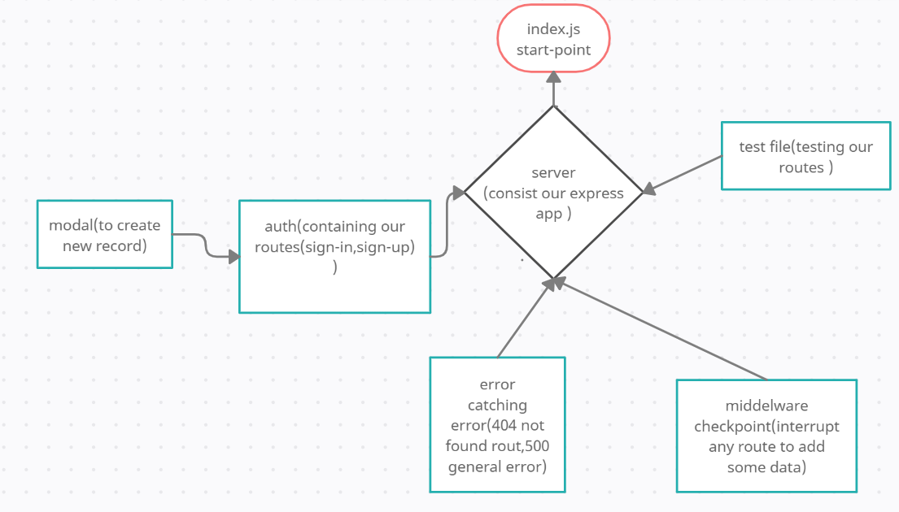

# basic-auth

- Heroku applications :https://marwan-basic-auth.herokuapp.com/

- pull request:https://github.com/marwanrawshedh/basic-auth/pull/2

## How do I install the app or library?

- you have to clone it on your local machine
## How do I test the app or library?
- npm run test
## How do I run the app?
- npm run dev

